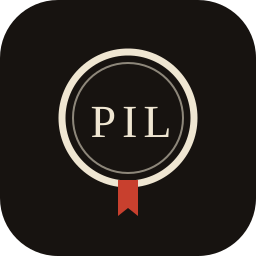
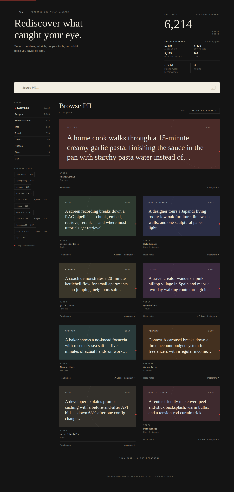
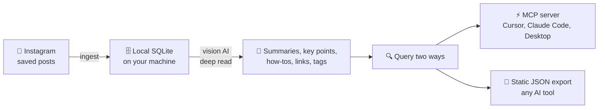

<p align="center">
  
</p>

### Your Instagram saved posts — deep-read by AI, searchable forever, on *your* machine.

[](LICENSE)
[](https://github.com/pjpoulose/PIL/pulls)
[](https://github.com/pjpoulose/PIL/stargazers)

[](references/mcp_clients.md)
[](references/mcp_clients.md)
[](references/mcp_clients.md)

**🚀 Get started · 🔁 How it works · 🤖 Other AI tools · 📦 What's inside**

---

> ### Get PIL in 3 steps
>
> **1.** Copy-paste this into Muse:
>
>         Clone https://github.com/pjpoulose/PIL into your workspace and follow its
>         SKILL.md to set up my Personal Instagram Library. Work through it step by
>         step — install, build the library from my saved posts, and hand me the
>         installable app.
>
> **2.** When it asks, link your Instagram (one tap in your browser).
>
> **3.** Download the app file it sends you → unzip → double-click **Start PIL** → click **Install**.
>
> That's the whole thing. Your Muse does the setup, the reading, and the building.
> For your phone afterward, see [📱 Take it on your phone](#-take-it-on-your-phone).
>
> <details>
> <summary>Prefer to do it yourself? One command sets everything up.</summary>
>
> - Mac / Linux: `curl -fsSL https://raw.githubusercontent.com/pjpoulose/PIL/master/bootstrap.sh | bash`
> - Windows (PowerShell): `irm https://raw.githubusercontent.com/pjpoulose/PIL/master/bootstrap.ps1 | iex`
>
> Then build your library with the commands in [🛠️ Manual setup](#-manual-setup-do-it-yourself).
> </details>

---

Every day you save posts you'll never find again. **PIL (Personal Instagram Library)** turns your Instagram saved collection into a private knowledge base on your own machine: every post deep-read by vision AI — narrative summaries, key points, how-to steps, links it discusses, automatic tags — searchable in seconds and queryable live from your AI coding tools.

> **Code is shared, data stays home.** This repo contains only code, the database schema, config examples, and docs. Your saved posts, captions, and account details never leave your computer — ingestion, extraction, search, and the MCP server all run locally. A `.gitignore` blocks databases, configs, and exports from ever being committed.



*Concept mockup with sample data — your library looks like this, with your posts.*

## 🔁 How it works



## 🛠️ Manual setup (do it yourself)

<details>
<summary>Expand — only needed if you're skipping the 3-step Muse flow at the top.</summary>

**Prerequisites:** `python3` (3.11+) and `instagram-cli` with your Instagram
account linked (run `instagram-cli accounts` — it must list your account).
The one-line installer at the top of this page handles all of this for you.

```bash
# 1. Get the code
git clone https://github.com/pjpoulose/PIL.git pil && cd pil

# 2. Configure (your data lives in data_dir, default ~/.local/share/pil)
cp pil.config.example.json ~/.config/pil/pil.config.json
# edit it: set account_id to your user_fbid from `instagram-cli accounts`

# 3. MCP server dependency
pip install "mcp<2"
```

**Build your library** (each step is resume-safe — re-run any time):

```bash
cd bin
python3 ingest_saved.py      # collections + saved posts
python3 extract_content.py   # vision-AI deep read (batches of 25)
python3 tag_all.py           # programmatic tags for untagged posts
python3 export_web.py        # static JSON export -> <data_dir>/web_data.json
python3 export_html.py       # searchable HTML dashboard -> <data_dir>/pil_library.html
python3 export_pwa.py        # installable PWA bundle -> <data_dir>/pwa/
```

**Ask it anything** — via the live MCP server *or* the static export:

```bash
python3 bin/mcp_server.py    # read-only, stdio — Ctrl-C to stop
```

That's it. Re-run `ingest_saved.py` whenever you save new posts; `extract_content.py`
only processes posts it hasn't seen yet.

**Install it like an app** — no Python needed from here on:

- **Computer:** [Get the browser install prompt](#get-the-browser-install-prompt-pwa--one-click)
  — unzip the PWA folder, double-click the launcher for your OS, click Install.
- **Phone:** [Take it on your phone](#-take-it-on-your-phone) — one publish
  command, then scan the QR code with your phone.

</details>

## 🆚 Why not just scroll your saved tab?

| | Instagram saved tab | PIL |
|---|---|---|
| Find a post from 2 years ago | Scroll endlessly | Full-text search in seconds |
| Remember what a post actually said | Rewatch / reread it | AI summary, key points, how-to |
| Links a post mentioned | Gone unless you saved them | Extracted and clickable |
| Use it inside your AI tools | Screenshots and retyping | MCP server or JSON export |
| Where your data lives | Meta's servers | Your machine, SQLite |

## 🔍 Query it live (MCP)

Wire it into your client — see [references/mcp_clients.md](references/mcp_clients.md)
for Claude Code, Claude Desktop, and Cursor configs. Available tools:

| Tool | What it does |
|---|---|
| `search_posts` | Text search over captions + deep-read knowledge, with optional folder/tag filters |
| `get_post` | Full record for one post: summary, key points, how-to, links, folders, tags |
| `list_folders` | Your saved collections with indexed counts |
| `list_tags` | Tags by usage |
| `library_stats` | Totals + deep-read coverage per field |

The server opens the database with SQLite `mode=ro` and exposes SELECT-only
tools — it cannot modify your library. (Attack-tested: SQL injection, write
attempts, and limit abuse all verified blocked.)

## 📄 Query it manually (static export)

`export_web.py` writes `<data_dir>/web_data.json`: every post with a
280-character caption snippet plus deep-read knowledge where available. Upload
that file into any AI chat tool to ask questions over your library.

## 🤖 Use your library with other AI tools

Your library isn't locked to the app — point any AI tool at it:

**Any AI chat (Claude, ChatGPT, …)** — attach `web_data.json` (built by
`export_web.py`, in your data dir): every post with its deep-read knowledge in
one file. Ask questions over it like any document. It's a snapshot — re-export
after you save new posts.

**Coding assistants (Claude Code, Cursor, …)** — connect the read-only MCP
server (`bin/mcp_server.py` over stdio) and they can search posts, read
summaries, and pull how-tos live. See
[references/mcp_clients.md](references/mcp_clients.md) for wiring; any
MCP-compatible client works.

**Directly (advanced)** — the database is plain SQLite at
`<data_dir>/pil.sqlite` (schema in `schema.sql`). Open it read-only with any
SQLite tool.

These files hold your personal Instagram data — keep them on your own machine
and only share them with tools you trust.

## 🖥️ Your library as a desktop web app

`export_html.py` writes `<data_dir>/pil_library.html` — a single self-contained
file with your whole library: search, rooms, tags, sorting, and expandable
read-notes per post. No server, no network; it works straight from disk.

**Keep it on your desktop like an app:**

1. Run `python3 bin/export_html.py`, then move `pil_library.html` to your Desktop
   (or anywhere you like).
2. Double-click it — it opens in your browser, fully offline.
3. To make it feel like a real app window instead of a browser tab:
   - **Chrome / Edge:** ⋮ menu → *More tools* → *Create shortcut…* → tick
     *Open as window* → Create. Launch it from your dock/taskbar from then on.
   - **Safari:** *File* → *Add to Dock…* (macOS Sonoma and later).
   - **Firefox:** double-click the file, or drag it to the dock/taskbar for a
     one-click opener.

Re-run `export_html.py` whenever you save new posts to refresh it. The file
holds your data, so keep it on your own machine like anything personal.

### Get the browser install prompt (PWA) — one click

Prefer the real *Install app* prompt over a manual shortcut? `export_pwa.py`
builds a small installable bundle — `index.html`, `manifest.json`, an offline
service worker, icons, **and one-click launchers** — into `<data_dir>/pwa/`:

```bash
python3 bin/export_pwa.py
```

Then it's three steps, no terminal skills needed:

1. Unzip the `pwa` folder anywhere.
2. Launch it:
   - **Mac**: double-click `Make Mac App.command` once — it builds a polished
     `Start PIL.app` (proper icon, no terminal window). From then on,
     double-click the app. First launch: right-click → *Open* to clear
     Apple's one-time check.
   - **Windows**: double-click `Start PIL.vbs` — no console window.
     `Stop PIL.vbs` stops the server when you're done.
   - **Linux**: double-click (or run) `Start PIL.command`.
3. Click **Install** in the browser's address bar (Chrome/Edge).

`localhost` counts as a secure context in every browser, so installation and
offline mode work with no HTTPS setup. What each browser does:

- **Chrome / Edge** (desktop & Android): offers the **Install** prompt
  automatically once the page loads.
- **Safari** (macOS): *File → Add to Dock…*; (iOS): *Share → Add to Home
  Screen*. No auto-prompt — Apple reserves that for the menu, by design.
- **Firefox**: *Add to Home Screen* (Android), or bookmark / pin the
  localhost page manually on desktop.

The single-file `pil_library.html` above keeps working as before for anyone
who'd rather just double-click a file — no server needed.

### 📱 Take it on your phone

Phones can't reach the desktop launcher — they need the PWA on `https`. One
command publishes the bundle to hosting you control, then your phone installs
it like a native app (Android: Chrome → Install app · iPhone: Safari → Share
→ Add to Home Screen). Fully offline after the first load. See
[MOBILE.md](MOBILE.md):

```bash
python3 bin/publish_pwa.py <data_dir>/pwa --provider netlify
```

## 📦 What's inside

```
pil/
├── assets/logo.svg          # the seal above
├── SKILL.md                 # skill definition (for Muse)
├── README.md                # this file
├── LICENSE                  # MIT
├── schema.sql               # the five tables: folders, posts, post_folders, knowledge, tags
├── pil.config.example.json  # copy to pil.config.json and set your account_id
├── bootstrap.sh             # one-line installer for Mac/Linux
├── bootstrap.ps1            # one-line installer for Windows
├── bin/
│   ├── pil_common.py        # config resolution + DB helpers
│   ├── ingest_saved.py      # step 1: ingest (resume-safe)
│   ├── extract_content.py   # step 2: vision-AI extraction (resume-safe)
│   ├── tag_all.py           # step 3: tagging
│   ├── export_web.py        # step 4: static export
│   ├── export_html.py       # step 5: self-contained HTML dashboard
│   ├── export_pwa.py        # step 6: installable PWA bundle (manifest + SW + icons)
│   ├── publish_pwa.py       # step 7: publish PWA to your own host for phone install
│   └── mcp_server.py        # read-only MCP server (stdio)
└── references/
    └── mcp_clients.md       # Cursor / Claude Code / Claude Desktop wiring
```

## ❓ FAQ

**Do I need to know how to code?**
No. The one-line installer at the top of this page handles setup — copy-paste
is the hardest part. If even that feels like too much, install the PIL skill in
your AI assistant and say *"set up my Instagram library"*; it does everything
with you.

**Where does my Instagram data go?**
Nowhere. *Code is shared, data stays home:* your saved posts, captions, and
account details never leave your computer. Nothing is uploaded to us — there is
no "us"; there's no server, no account, no cloud.

**Does it cost anything?**
PIL is free and open-source (MIT). There is no subscription and no account to
create. The AI deep-read step runs through your own Instagram/AI setup.

**Does the app work offline?**
Yes. Once installed, the desktop and phone apps run fully offline — search,
rooms, tags, and answers all work without internet.

**Which phones and computers?**
Windows, Mac, and Linux for the desktop app; iPhone and Android for the phone
app. On Android, tap **Install app** in Chrome; on iPhone, use Safari's
**Share → Add to Home Screen**.

**I saved new posts — how do I add them?**
Re-run `python3 bin/ingest_saved.py` (only new posts are fetched), then
re-run the export step for the app you use. The installer and scripts are all
safe to re-run.

**Can I share my library with someone?**
Your library is files on your machine — you *can* copy them to someone else's
computer, but they contain your personal Instagram data. Treat them like
anything private: don't publish or upload them anywhere public.

**Something failed — what now?**
Re-run the installer; it's safe to run any number of times. Make sure Python
is 3.11 or newer (`python3 --version`). If you're stuck, see
[🔧 Troubleshooting](#-troubleshooting) or open an issue.

## 🔧 Troubleshooting

- `PIL account_id is not configured` → copy the example config and set
  `account_id` to your `user_fbid` from `instagram-cli accounts`.
- Extraction is slow on huge libraries — it's resume-safe; just re-run it.
- `429` rate limits are handled with backoff inside the scripts.
- The MCP server needs `mcp<2` in the Python that runs it (2.x renamed the API).

## 🤝 Contributing

PRs and issues welcome — better extraction prompts, new query clients, new
export formats. Fork it, ship it, make it yours. If it saved you from the
endless scroll, a ⭐ helps others find it.

## 📜 License

MIT. Built by [Paul Poulose](https://github.com/pjpoulose).
