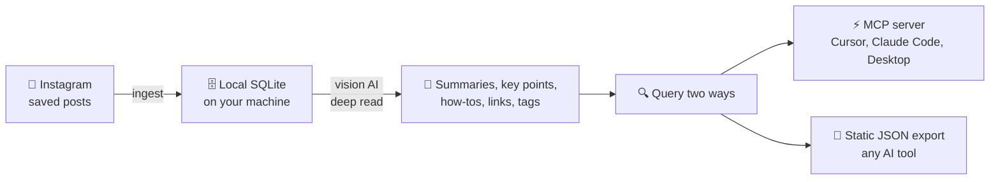

<p align="center">
  
</p>

### Your Instagram saved posts — deep-read by AI, searchable forever, on *your* machine.

[](LICENSE)
[](https://github.com/pjpoulose/PIL/pulls)
[](https://github.com/pjpoulose/PIL/stargazers)

[](references/mcp_clients.md)
[](references/mcp_clients.md)
[](references/mcp_clients.md)

**⬇️ Install · ⚡ Quick start · 🔁 How it works · 🔍 Query it · 📦 What's inside**

---

Every day you save posts you'll never find again. **PIL (Personal Instagram Library)** turns your Instagram saved collection into a private knowledge base on your own machine: every post deep-read by vision AI — narrative summaries, key points, how-to steps, links it discusses, automatic tags — searchable in seconds and queryable live from your AI coding tools.

> **Code is shared, data stays home.** This repo contains only code, the database schema, config examples, and docs. Your saved posts, captions, and account details never leave your computer — ingestion, extraction, search, and the MCP server all run locally. A `.gitignore` blocks databases, configs, and exports from ever being committed.

## 🔁 How it works



## ⬇️ Install

Prerequisites: `python3`, and `instagram-cli` with your Instagram account linked
(run `instagram-cli accounts` — it must list your account).

```bash
# 1. Get the code
git clone https://github.com/pjpoulose/PIL.git pil && cd pil

# 2. Configure (your data lives in data_dir, default ~/.local/share/pil)
cp pil.config.example.json ~/.config/pil/pil.config.json
# edit it: set account_id to your user_fbid from `instagram-cli accounts`

# 3. MCP server dependency
pip install "mcp<2"
```

## ⚡ Quick start

**1. Build your library** (each step is resume-safe — re-run any time):

```bash
cd bin
python3 ingest_saved.py      # collections + saved posts
python3 extract_content.py   # vision-AI deep read (batches of 25)
python3 tag_all.py           # programmatic tags for untagged posts
python3 export_web.py        # static JSON export -> <data_dir>/web_data.json
```

**2. Ask it anything** — via the live MCP server *or* the static export:

```bash
python3 bin/mcp_server.py    # read-only, stdio — Ctrl-C to stop
```

That's it. Re-run `ingest_saved.py` whenever you save new posts; `extract_content.py`
only processes posts it hasn't seen yet.

## 🆚 Why not just scroll your saved tab?

| | Instagram saved tab | PIL |
|---|---|---|
| Find a post from 2 years ago | Scroll endlessly | Full-text search in seconds |
| Remember what a post actually said | Rewatch / reread it | AI summary, key points, how-to |
| Links a post mentioned | Gone unless you saved them | Extracted and clickable |
| Use it inside your AI tools | Screenshots and retyping | MCP server or JSON export |
| Where your data lives | Meta's servers | Your machine, SQLite |

## 🔍 Query it live (MCP)

Wire it into your client — see [references/mcp_clients.md](references/mcp_clients.md)
for Claude Code, Claude Desktop, and Cursor configs. Available tools:

| Tool | What it does |
|---|---|
| `search_posts` | Text search over captions + deep-read knowledge, with optional folder/tag filters |
| `get_post` | Full record for one post: summary, key points, how-to, links, folders, tags |
| `list_folders` | Your saved collections with indexed counts |
| `list_tags` | Tags by usage |
| `library_stats` | Totals + deep-read coverage per field |

The server opens the database with SQLite `mode=ro` and exposes SELECT-only
tools — it cannot modify your library. (Attack-tested: SQL injection, write
attempts, and limit abuse all verified blocked.)

## 📄 Query it manually (static export)

`export_web.py` writes `<data_dir>/web_data.json`: every post with a
280-character caption snippet plus deep-read knowledge where available. Upload
that file into any AI chat tool to ask questions over your library.

## 📦 What's inside

```
pil/
├── assets/logo.svg          # the seal above
├── SKILL.md                 # skill definition (for Muse)
├── README.md                # this file
├── LICENSE                  # MIT
├── schema.sql               # the five tables: folders, posts, post_folders, knowledge, tags
├── pil.config.example.json  # copy to pil.config.json and set your account_id
├── bin/
│   ├── pil_common.py        # config resolution + DB helpers
│   ├── ingest_saved.py      # step 1: ingest (resume-safe)
│   ├── extract_content.py   # step 2: vision-AI extraction (resume-safe)
│   ├── tag_all.py           # step 3: tagging
│   ├── export_web.py        # step 4: static export
│   └── mcp_server.py        # read-only MCP server (stdio)
└── references/
    └── mcp_clients.md       # Cursor / Claude Code / Claude Desktop wiring
```

## 🔧 Troubleshooting

- `PIL account_id is not configured` → copy the example config and set
  `account_id` to your `user_fbid` from `instagram-cli accounts`.
- Extraction is slow on huge libraries — it's resume-safe; just re-run it.
- `429` rate limits are handled with backoff inside the scripts.
- The MCP server needs `mcp<2` in the Python that runs it (2.x renamed the API).

## 🤝 Contributing

PRs and issues welcome — better extraction prompts, new query clients, new
export formats. Fork it, ship it, make it yours. If it saved you from the
endless scroll, a ⭐ helps others find it.

## 📜 License

MIT. Built by [Paul Poulose](https://github.com/pjpoulose).
